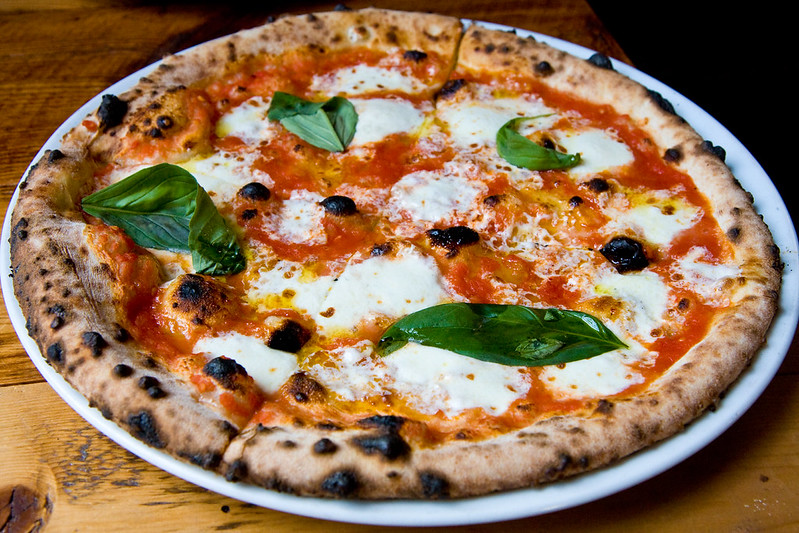

# Margherita Pizza

- Cuisine Type: Italian
- Preparation Time: 20 minutes
- Cooking Time: 10–15 minutes
- Serving Size: 2 pizzas (about 4 servings)

## Ingredients

- Pizza dough (store-bought or homemade), 2 balls (about 340 g each)
- Chopped tomatoes, 3/4 cup (about 180 g)
- Olive oil, 2 tbsp
- Garlic, 2 cloves (crushed)
- Salt, 1/2 tsp (plus more to taste)
- Dried oregano, 1 tsp
- Fresh mozzarella (torn), 300 g
- Fresh basil leaves, 1 cup (tightly packed)
- Grated parmesan (optional), 1/4 cup

## Method

1. Heat oven to 260°C/500°F (or as high as it goes). If you have a pizza stone or steel, preheat it too.
2. In a bowl, mix crushed tomatoes, olive oil, minced garlic, salt, and oregano.
3. Stretch or roll dough into two rounds. If using parchment, place each round on its own sheet.
4. Spread sauce over the dough.
5. Tear mozzarella and scatter it over the sauce (don’t flatten it too much).
6. Bake 10–15 minutes, until the crust is browned and the cheese is bubbling.
7. Remove pizzas, top with basil, and sprinkle Parmesan if using. Slice and serve immediately.

## Serving Suggestions

Serve with a simple rocket salad (rocket, olive oil, lemon, salt) and a chilled glass of lemonade or beer.

## Photo

“<a href="https://www.flickr.com/photos/garrettziegler/7176133684" title="Margherita pizza, Barboncino">Margherita pizza, Barboncino</a>” by <a href="https://www.flickr.com/photos/garrettziegler/">Garrett Ziegler</a>, <a href="https://creativecommons.org/licenses/by-nc-nd/2.0/deed.en" rel="license noopener noreferrer">CC BY-NC-ND 2.0</a>
