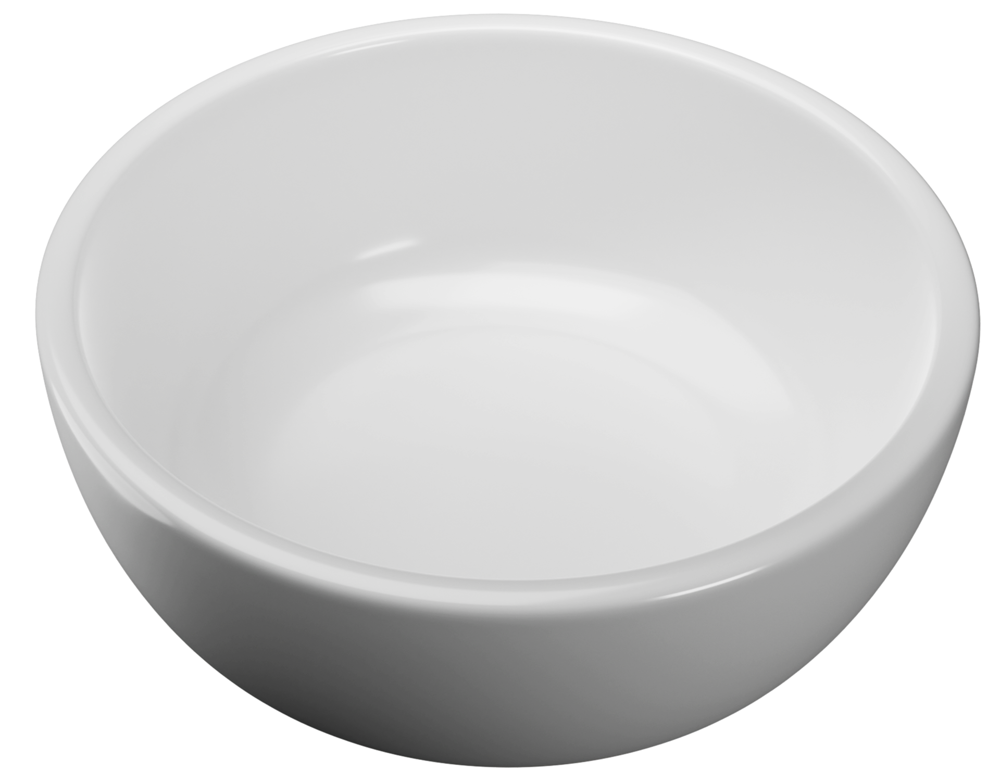

<!-- Where to save this file:
     recipes/<cuisine>/<recipe_name>.md
       <cuisine> should be lowercase
       <recipe_name> should be lowercase, derived from the title of the recipe, with spaces replaced by underscores (_)
-->

# Recipe Title

- Cuisine Type:
- Preparation Time:
- Cooking Time:
- Serving Size:

## Ingredients (clear list with quantities)

- first ingredient, quantity
- second ingredient, quantity
- third ingredient, quantity

## Method (step-by-step instructions)

1. First step
2. Second step
3. Third step

## Serving Suggestions

## Photo (optional)

For help with writing Markdown, see [The Markdown Guide](https://www.markdownguide.org/).

